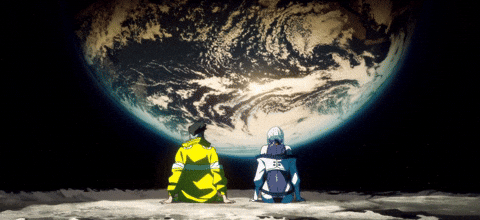

<picture>
  <source media="(prefers-color-scheme: dark)" srcset="./assets/neofetch-dark.svg" />
  <source media="(prefers-color-scheme: light)" srcset="./assets/neofetch-light.svg" />
  
</picture>

### ⚡ Stack

### 🧠 AI Toolkit

                   

### 🚀 Featured Builds

<table>
<tr><td width="33%" valign="top"><b>🎮 <a href="https://github.com/devvarth6565/game_builder">AI Game Builder</a></b> Prompt → playable game. A Groq agent codes it live in a Daytona sandbox</td><td width="33%" valign="top"><b>🏄 <a href="https://github.com/devvarth6565/CodeSurfer">CodeSurfer</a></b> Prompt → full Next.js app, built by Inngest agents in E2B sandboxes</td><td width="33%" valign="top"><b>🎓 <a href="https://github.com/devvarth6565/CareerSaarthiAI">CareerSaarthi AI</a></b> AI mentors that join live video calls through OpenAI Realtime</td></tr>
<tr><td width="33%" valign="top"><b>🔬 <a href="https://github.com/devvarth6565/dm_project">Research Trends Miner</a></b> 2.2M+ arXiv papers mined for trends and citation predictions</td><td width="33%" valign="top"><b>🎬 <a href="https://github.com/devvarth6565/charades-label-explorer">Charades Explorer</a></b> Search and QA for 66.5K video labels with SQLite FTS5 (live demo)</td><td width="33%" valign="top"><b>🤝 <a href="https://github.com/devvarth6565/devTinderWeb">DevTinder</a></b> Swipe, match and connect with developers (MERN + Redux)</td></tr>
</table>

